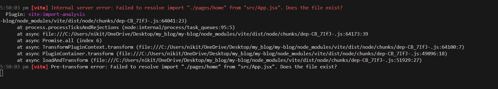

# My React Blog

A blog platform built with React and Vite.

## Setup Instructions
1. Clone the repository
2. Run `npm install`
3. Run `npm run dev`
4. Open http://localhost:5173 in your browser

## Project Structure
Explain your project structure here:
- `src/components/Header.jsx`: Contains the header component of the blog.
- `src/App.jsx`: Main component that renders the application structure.
- `src/index.css`: Styles for the application.

## Screenshot

## What I Learned
1. Setting up a React project with Vite.
2. Creating reusable components in React.
3. Using basic Git commands to manage project version control.

## Bonus Features

1. **Dark Mode Toggle**: Added a button to toggle between light and dark themes.
2. **Responsive Header**: The header adjusts for different screen sizes.
3. **Smooth Hover Effects**: Added smooth transitions for navigation links and dark mode toggle button.

## Screenshot

**Assignment 2**  

## Components Structure
- **BlogPost**: Displays individual blog post content.
- **BlogList**: Container for rendering a list of blog posts.
- **Header**: Displays site title and navigation links.

## Styling Approach
Used CSS Modules to scope styles to components and avoid conflicts. This approach makes the component styling modular and maintainable.

## New Features
- Blog post display with title, author, date, and content.
- Responsive design for mobile and desktop views.
- Dark mode support (optional, can be implemented with a toggle in CSS).

## Screenshots
- **Desktop View**: 
- **Mobile View**: 

### Assignment Summaries

**Assignment 3**  
Assignment 3 remains unchanged from Assignment 2.

**Assignment 4**  
After adding all required files and updating `BlogList.jsx`, the page displays as blank.

**Assignment 5**  
After adding and updating all specified files, the page shows as blank.

**Assignment 6**  
All required hook files have been successfully created.

**Assignment 7**  
All necessary context files have been successfully created.

**Assignment 8**  
All specified files have been created, and the required modules have been imported.

**Assignment 9**  
An import resolution error occurs when attempting to use the `ErrorBoundary` component in `App.jsx`. The Vite development server reports that it cannot locate the component, leading to a failure in compiling and running the application.

This issue suggests that Vite cannot resolve the `ErrorBoundary` component at the specified path in `App.jsx`. Possible causes include an incorrect path, a missing file extension, a case sensitivity mismatch, or caching issues in Vite.

